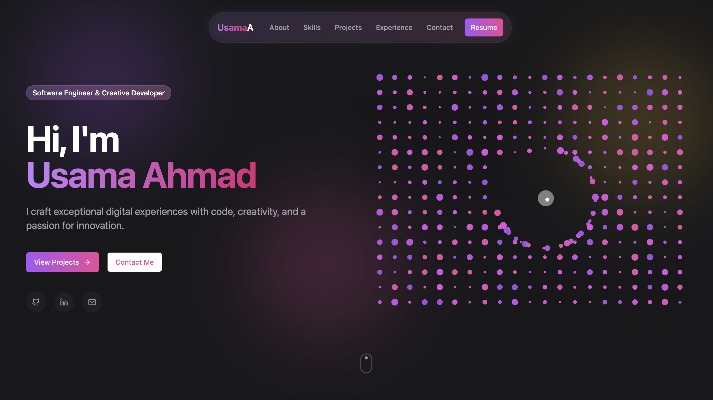

# Creative Portfolio - Usama Ahmad

A modern, responsive, and interactive portfolio website showcasing projects, skills, and experience. Built with Next.js 16, React 19, and TypeScript.



## 🌟 Features

### Core Features
- **Interactive Hero Section** - Animated particle canvas with gradient effects
- **Project Showcase** - Display projects with clickable images that open in full-screen popups
- **Skills Section** - Animated skill badges with progress indicators
- **Experience Timeline** - Chronological work experience with smooth scroll animations
- **Contact Form** - Functional contact form with Resend email integration
- **Responsive Design** - Fully responsive and optimized for all devices

### Interactive Elements
- **Floating Navigation** - Sticky navigation bar that appears on scroll
- **Scroll Progress Bar** - Visual indicator of scroll position
- **Mouse Follower** - Custom cursor effect with smooth animations
- **Scroll Animations** - Intersection Observer-based animations for smooth reveals
- **Image Popups** - Click project images to view them in full-screen modals

### Technical Features
- **Email Integration** - Contact form sends emails via Resend API
- **Optimized Images** - Next.js Image component for optimal performance
- **TypeScript** - Full type safety throughout the application
- **Modern UI Components** - Built with Radix UI and shadcn/ui
- **Dark Theme** - Beautiful dark theme with gradient accents

## 🚀 Technologies Used

### Core Framework
- **[Next.js 16](https://nextjs.org/)** - React framework with App Router
- **[React 19](https://react.dev/)** - UI library
- **[TypeScript](https://www.typescriptlang.org/)** - Type-safe JavaScript

### Styling & UI
- **[Tailwind CSS](https://tailwindcss.com/)** - Utility-first CSS framework
- **[Radix UI](https://www.radix-ui.com/)** - Accessible component primitives
- **[shadcn/ui](https://ui.shadcn.com/)** - Re-usable component library
- **[Lucide React](https://lucide.dev/)** - Icon library
- **[Framer Motion](https://www.framer.com/motion/)** - Animation library (for hero animations)

### Backend & Services
- **[Resend](https://resend.com/)** - Email delivery service for contact form
- **[Next.js API Routes](https://nextjs.org/docs/app/building-your-application/routing/route-handlers)** - Serverless API endpoints

### Development Tools
- **ESLint** - Code linting
- **PostCSS** - CSS processing
- **pnpm** - Package manager

## 📋 Prerequisites

Before you begin, ensure you have the following installed:
- Node.js 18+ 
- pnpm (or npm/yarn)
- Git

## 🛠️ Getting Started

### 1. Clone the Repository

```bash
git clone https://github.com/usama-ms/creative-portfolio.git
cd creative-portfolio
```

### 2. Install Dependencies

```bash
pnpm install
# or
npm install
# or
yarn install
```

### 3. Set Up Environment Variables

Create a `.env.local` file in the root directory:

```env
# Resend API Configuration
RESEND_API_KEY=re_xxxxxxxxxxxxxxxxxxxxxxxxxxxxx

# Email Configuration (Optional - defaults provided)
RESEND_RECIPIENT_EMAIL=your-email@example.com
RESEND_FROM_EMAIL=onboarding@resend.dev
```

**To get your Resend API key:**
1. Sign up at [resend.com](https://resend.com)
2. Navigate to [API Keys](https://resend.com/api-keys)
3. Create a new API key
4. Copy it to your `.env.local` file

### 4. Run the Development Server

```bash
pnpm dev
# or
npm run dev
# or
yarn dev
```

Open [http://localhost:3000](http://localhost:3000) in your browser to see the portfolio.

### 5. Build for Production

```bash
pnpm build
pnpm start
```

## 📁 Project Structure

```
creative-portfolio/
├── app/
│   ├── api/
│   │   └── contact/
│   │       └── route.ts          # Contact form API endpoint
│   ├── globals.css                # Global styles
│   ├── icon.jpg                   # Favicon
│   ├── layout.tsx                 # Root layout
│   └── page.tsx                   # Main portfolio page
├── components/
│   ├── ui/                        # Reusable UI components
│   ├── contact-form.tsx           # Contact form component
│   ├── creative-hero.tsx          # Hero section with animations
│   ├── floating-nav.tsx           # Navigation bar
│   ├── project-card.tsx           # Project showcase cards
│   ├── scroll-progress.tsx        # Scroll progress indicator
│   ├── skill-badge.tsx            # Skill display component
│   ├── timeline.tsx               # Work experience timeline
│   └── ...                        # Other components
├── hooks/
│   ├── use-intersection-observer.ts  # Custom scroll animation hook
│   └── use-mobile.tsx             # Mobile detection hook
├── public/
│   └── images/                    # Project images and assets
├── .env.local                     # Environment variables (not committed)
├── next.config.mjs                # Next.js configuration
├── tailwind.config.ts             # Tailwind CSS configuration
└── package.json                   # Dependencies and scripts
```

## 🎨 Customization

### Update Personal Information

1. **Hero Section** - Edit `app/page.tsx` to update name, title, and bio
2. **Projects** - Update project data in `app/page.tsx` (ProjectCard components)
3. **Skills** - Modify skills in `app/page.tsx` (SkillBadge components)
4. **Experience** - Update work experience in `components/timeline.tsx`
5. **Contact Info** - Update email and social links in `app/page.tsx`
6. **Favicon** - Replace `app/icon.jpg` with your profile image

### Styling

- **Colors** - Modify gradient colors in `tailwind.config.ts` and component files
- **Animations** - Adjust animation timings in `app/globals.css`
- **Layout** - Update spacing and layout in component files

## 📧 Contact Form Setup

The contact form uses Resend for email delivery. After setting up your `.env.local`:

1. The form sends emails to the address specified in `RESEND_RECIPIENT_EMAIL`
2. For testing, use `onboarding@resend.dev` as `RESEND_FROM_EMAIL`
3. For production, verify your domain in Resend and use your domain email

See the API route at `app/api/contact/route.ts` for email template customization.

## 🚀 Deployment

### Deploy to Vercel (Recommended)

1. Push your code to GitHub
2. Go to [vercel.com](https://vercel.com) and sign in
3. Click "New Project" and import your repository
4. Add environment variables in Vercel dashboard:
   - `RESEND_API_KEY`
   - `RESEND_RECIPIENT_EMAIL`
   - `RESEND_FROM_EMAIL`
5. Click "Deploy"

Vercel will automatically deploy your portfolio and provide a live URL.

### Deploy to Other Platforms

This project can be deployed to any platform that supports Next.js:
- **Netlify** - Connect GitHub and deploy
- **Railway** - Deploy with one click
- **AWS Amplify** - Full-stack deployment
- **Self-hosted** - Build and serve with `pnpm build && pnpm start`

## 🔧 Available Scripts

- `pnpm dev` - Start development server
- `pnpm build` - Build for production
- `pnpm start` - Start production server
- `pnpm lint` - Run ESLint

## 📝 License

This project is open source and available under the [MIT License](./LICENSE).

## 👤 Author

**Usama Ahmad**
- Portfolio: [GitHub](https://github.com/usama-ms)
- Email: usama.ahmad00033@gmail.com
- LinkedIn: [linkedin.com/in/usamaahmad81/](https://linkedin.com/in/usamaahmad81/)

## 🙏 Acknowledgments

- Built with [Next.js](https://nextjs.org/)
- UI components from [shadcn/ui](https://ui.shadcn.com/)
- Icons from [Lucide](https://lucide.dev/)
- Email service by [Resend](https://resend.com/)

---

⭐ If you find this project helpful, please consider giving it a star on GitHub!
